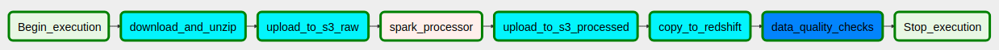
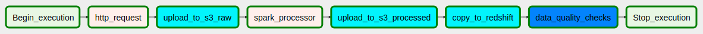
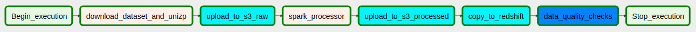
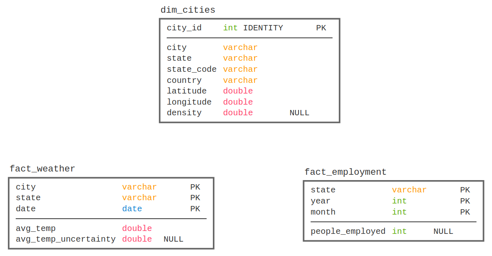

# City Recommendation System

This is the **capstone project** of Udacity's [Data Engineering Nanodegree](https://www.udacity.com/course/data-engineer-nanodegree--nd027).

## Introduction

The purpose of this project is to serve as a recommendation system of cities, taking several factores into consideration and ultimately recommending the best city to live in for someone.

It is a data pipeline orchestrated by **Airflow** consisting of extracting data from diverse sources, storing them in a **S3 Bucket** and then processing them using **Spark** into a **Data Warehouse** in **Redshift**. The populated database can be used with ad-hoc queries to gather insight into the best features of each city or be used as a ranking system to evaluate the best city overall tanking into account the person's interest.

## Resources

* [`create_cluster.py`](./create_cluster.py) is a script to create a Redshift cluster (and everything else necessary) using the provided credentials in the [`settings.cfg`](./settings.cfg) file.
* [`delete_cluster.py`](./delete_cluster.py) is a script to delete the Redshift cluster and remove the role created to access S3 buckets.
* [`create_tables.py`](./create_tables.py) is a script to (re)create the dimension and fact tables for the star schema in Redshift.
* `sql_statements.py` is used to define the SQL statements which will be imported into `create_tables.py` file.
* `docker-compose.dev.yml` is a docker-compose file to create an Airflow instance running the webserver, a Postgres database, a Spark master node and a Spark worker node to be used for local development.
* `cities.py` is a DAG file to load data from S3 into the staging tables on Redshift and then processes that data into the analytics tables.
* The `settings.cfg` file should have the following structure and its values must be filled in.

```ini
[AWS]
KEY=
SECRET=

[CLUSTER] 
CLUSTER_TYPE=multi-node
NUM_NODES=4
NODE_TYPE=dc2.large

IAM_ROLE_NAME=
CLUSTER_IDENTIFIER=
HOST=
DB_NAME=
DB_USER=
DB_PASSWORD=
DB_PORT=

[IAM_ROLE]
ARN=
```

## Data Sources

* Population 
  * https://simplemaps.com/data/us-cities
* Employment numbers
  * https://api.bls.gov/publicAPI/v2/timeseries/data/CEU0500000003
* Weather
  * https://www.kaggle.com/berkeleyearth/climate-change-earth-surface-temperature-data#GlobalLandTemperaturesByCity.csv


## Future Work

* Safety
* cost of living, housing indicators, health care, traffic, crime and pollution.
  
## Getting Started

* add connections to airflow (s3_conn,aws_credentials)
* add variables to airflow (kaggle_username, kaggle_api_key, bls_api_key)






## Data Model

The data model chosen to represent the data processed by the ETL is the following:


