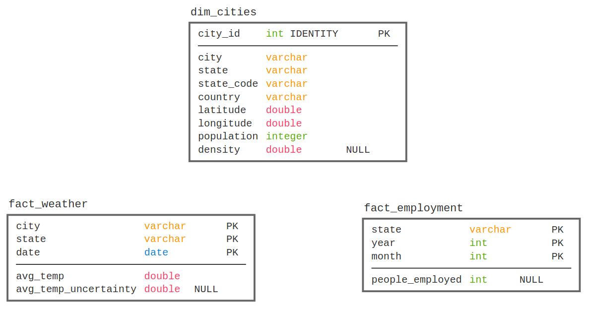

# City Recommendation System

This is the **capstone project** of Udacity's [Data Engineering Nanodegree](https://www.udacity.com/course/data-engineer-nanodegree--nd027).

## Introduction

The purpose of this project is to serve as a recommendation system for cities of the United States, taking several factores into consideration and ultimately recommending the best city to live in for someone.

It is a data pipeline orchestrated by **Airflow** consisting of extracting data from diverse sources, storing them in a **S3 Bucket** and then processing them using **Spark** into a **Data Warehouse** in **Redshift**. The populated database can be used with ad-hoc queries to gather insight into the best features of each city or be used as a ranking system to evaluate the best city overall tanking into account the person's interest.

## Resources

* [`create_cluster.py`](./create_cluster.py) is a script to create a Redshift cluster (and everything else necessary) using the provided credentials in the `settings.cfg` file.
* [`delete_cluster.py`](./delete_cluster.py) is a script to delete the Redshift cluster and remove the role created to access S3 buckets.
* [`create_tables.py`](./create_tables.py) is a script to (re)create the dimension and fact tables for the star schema in Redshift.
* [`sql_statements.py`](./sql_statements.py) is used to define the SQL statements which will be imported into [`create_tables.py`](./create_tables.py) file.
* [`docker-compose.dev.yml`](./docker-compose.dev.yml) is a docker-compose file to create an Airflow instance running the webserver, a Postgres database, a Spark master node and a Spark worker node to be used for local development.
* [`cities.py`](./airflow/dags/cities.py) is a DAG file to download US city data, upload to S3, process using Spark and load into Redshift.
* [`employment.py`](./airflow/dags/employment.py) is a DAG file to download US employment data, upload to S3, process using Spark and load into Redshift.
* [`weather.py`](./airflow/dags/weather.py) is a DAG file to download US weather data, upload to S3, process using Spark and load into Redshift.
* The `settings.cfg` file should have the following structure and its values must be filled in.

```ini
[AWS]
KEY=
SECRET=

[CLUSTER] 
CLUSTER_TYPE=multi-node
NUM_NODES=4
NODE_TYPE=dc2.large

IAM_ROLE_NAME=
CLUSTER_IDENTIFIER=
HOST=
DB_NAME=
DB_USER=
DB_PASSWORD=
DB_PORT=

[IAM_ROLE]
ARN=
```
## Data Sources

* City and Population
  * Source: [simplemaps](https://simplemaps.com/data/us-cities)
  * Information: city, state, state_code, country, latitude, longitude, population, density.
* Employment numbers
  * Source: [US Government Bureau of Labor Statistics](https://www.bls.gov/help/hlpforma.htm#SM)
  * Information: people_employed, state, year, month
* Weather
  * Source: [Kaggle dataset for Land Temperatures](https://www.kaggle.com/berkeleyearth/climate-change-earth-surface-temperature-data#GlobalLandTemperaturesByCity.csv) and [OpenCage geocoding API](https://opencagedata.com/api) to retrieve a state from a geocode.
  * Information: avg_temp, avg_temp_uncertainty, city, state, date
  
## Getting Started

* Run [`docker-compose.dev.yml`](./docker-compose.dev.yml) to setup the environment, containing an Airflow instance and Spark nodes.
  * Add connections to airflow
    *  `s3_conn`: access key and secret key to upload files to S3 bucket.
    *  `aws_credentials`: access key and secret access key to read S3 information from Spark and to manage Redshift instance.
  * Add variables to airflow
    *  `kaggle_username`: username of the Kaggle user to download dataset.
    *  `kaggle_api_key`: key used to authenticate to Kaggle API.
    *  `bls_api_key`: key used to authenticate to BLS API and avoid daily request limits
    *  `opencage_api_key`: key used to authenticate to OpenCage API.
* Run [`create_cluster.py`](./create_cluster.py) to setup a Redshift cluster or create an instance via AWS console.
* Run [`create_tables.py`](./create_tables.py) to create the tables used in Redshift.

Alternatively, in a **production setting**, one could use a **EC2 instance** running Airflow and a **EMR cluster** to connect to.

## Data Pipeline

The Data Pipeline is orchestrated by Airflow using three DAGs:
* [`cities.py`](./airflow/dags/cities.py) begins by downloading a `.zip` file, extracting its contents into a `.csv` file, uploading to a S3 bucket, which is then processed by Spark to filter unused rows, choose the appropriate columns and rename when necessary. The processed data is then uploaded to S3 so that a `COPY` command can be executed, loading the `dim_cities` table in Redshift. The final task is used as a data quality check to ensure that everything was loaded correctly.
* [`employment.py`](./airflow/dags/employment.py) DAG works similarly, but the data source is a Web API that returns `.json` structured data. The `spark_processor` task is also slightly different because it needs to explode the deeply nested data resulted from the `POST` call to the API. The data is retrieved **monthly**, as the source is updated.
* [`weather.py`](./airflow/dags/weather.py) is also similar, but the source is a Kaggle dataset and the `spark_processor` task has to filter the data from United States and since the dataset only has city names (that can have duplicates across states), it needs to make a request to the OpenCage API using a lat, long tuple to return the state located in those coordinates.


Since the current data sources do not update daily, it isn't necessary to increase the DAG run frequency, but with the addition of more data sources (more frequently updated), this data pipeline model is generic enough to easily fit these types of daily or even hourly-updated sources, as it is possible to upload the data to S3 (that could work as a Data Lake for raw information) and then load it into Redshift for a more structured organization.

## Data Model

The data model chosen to represent the data processed by the pipeline is a star schema in a Data Warehouse so that certain ad-hoc queries are possible to analyze the data, but there are also different **distribution styles** and **sortkeys** in order for the data to be able to scale without losing too much performance.

* `dim_cities` uses `diststyle all`, since it is small enough (<5MB) to fit in all Redshift nodes and this way provides a fast way to access this dimension data and avoiding shuffling when using `JOIN`s.
* `fact_weather` uses `distkey` on `state`, since queries will mostly be made against cities and states  and `sortkey` on `date` to be able to filter certain dates and make aggregations more performant.
* `fact_employment` uses `distkey` on `state` and a `compound sortkey` on `(year, month)` for similiar reasons as `fact_weather`.



## Scaling Data volume

The architecture chosen can scale well, as the tables are distributed in a way to reduce the number of partitions read by each query. It also takes into account the number of concurrent access it needs to handle, since Redshift can ditribute the processing into its nodes for each request.

Spark can handle the volume increase as well, using parallel processing by following a similar distribution logic as the Redshift tables.

* **Increasing data by 100x**
  * If the data intake was increased by 100x, it would be wise to use **Parquet** files and partition the data stored into **S3** so that Spark can parallelize the processing. Airflow could fetch the data more frequently to disperse the processing over time and therefore soften both concentrated reads and writes. The table model would not need too much changes, since it can easily store and provide access to much more data than it currently holds using the sort methods and distrubution styles chosen.
* **Running the data pipeline daily at 7 am**
  * If the pipeline was run daily, it would still work as expected, since Spark would process the daily amount of data and Redshift would receive the data normally. If for some reason there is an error during the execution of the DAG, each task can retry **3** times before the DAG failing. If it does fail, a dashboard consuming the data from Redshift would not fail to render, but would not have the most up to date information, showing only the data from the day before.
* **Handling 100+ people connecting to the database**
  * If the number of people connected concurrently to the database increased to 100+, a possible strategy to soften the hit on the reads would be to provide **a single or few points of connection**, for example a dashboard that handles certain queries.

## Future Work

This system could be further enriched with more data sources, such as

* Safety
* Cost of living
* Housing indicators
* Health care
* Traffic
* Crime 
* Pollution